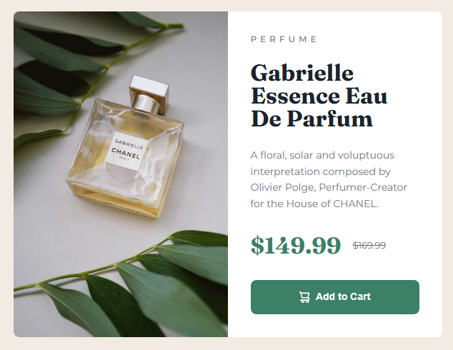

# Frontend Mentor - Product preview card component solution

This is a solution to the [Product preview card component challenge on Frontend Mentor](https://www.frontendmentor.io/challenges/product-preview-card-component-GO7UmttRfa). Frontend Mentor challenges help you improve your coding skills by building realistic projects.

## Table of contents

- [Overview](#overview)
  - [The challenge](#the-challenge)
  - [Screenshot](#screenshot)
  - [Links](#links)
- [My process](#my-process)
  - [Built with](#built-with)
  - [What I learned](#what-i-learned)
  - [Continued development](#continued-development)
  - [Useful resources](#useful-resources)
  - [AI Collaboration](#ai-collaboration)
- [Author](#author)
- [Acknowledgments](#acknowledgments)

## Overview

### The challenge

Users should be able to:

- View the optimal layout depending on their device's screen size
- See hover and focus states for interactive elements

The card stacks the product photo above the copy on smaller screens, then switches to a two-column layout on wider viewports. The **Add to Cart** button has a darker green on hover and a visible outline on keyboard focus.

### Screenshot



### Links

- [Solution URL](https://www.frontendmentor.io/solutions/product-preview-card-component-gznAd491vU)
- [Live Site URL](https://diogoluxa.github.io/frontend-mentor-product-preview-card/)

## My process

### Built with

- Semantic HTML5 (`main`, `picture`, `h1`, `footer`)
- CSS custom properties for colors, type, and spacing tokens
- Flexbox for the card content, price row, and button
- CSS Grid to center the page and split the card into two columns on desktop
- Mobile-first styles, with a layout change at `768px`
- BEM-style class names (`card-product`, `card-product__title`, …)
- [Montserrat](https://fonts.google.com/specimen/Montserrat) and [Fraunces](https://fonts.google.com/specimen/Fraunces) from Google Fonts

### What I learned

A few techniques from this challenge stood out.

**Art direction with `picture`.** The same product needs a different crop on mobile and desktop. `picture` + `source` lets the browser pick the right image instead of stretching one photo for every screen.

```html
<picture class="card-product__media">
  <source
    media="(max-width: 600px)"
    srcset="./images/image-product-mobile.jpg"
  />
  
</picture>
```

**Design tokens in `:root`.** Putting colors, font sizes, and weights in custom properties made it easier to stay consistent with the style guide and to tweak values in one place.

```css
:root {
  --green-500: hsl(158, 36%, 37%);
  --green-700: hsl(158, 42%, 18%);
  --font-montserrat: "Montserrat", sans-serif;
  --font-fraunces: "Fraunces", serif;
}
```

**Grid for the desktop card.** On wider screens the card becomes two equal columns. The image fills its column with `height: 100%` and `object-fit: cover`, so it matches the text side.

```css
@media (min-width: 768px) {
  .card-product {
    display: grid;
    grid-template-columns: 1fr 1fr;
  }
}
```

**Hover and keyboard focus.** `:hover` alone is not enough. `:focus-visible` keeps a clear outline for people who tab to the button, without forcing a ring on every mouse click.

### Continued development

I want to keep practicing:

- Responsive layouts that hold up from about `320px` up to large desktops, not only the two design widths
- Accessible interactive states (`:focus-visible`, contrast, meaningful `alt` text)
- When to reach for Flexbox vs Grid, instead of using both by habit
- Fluid sizing with `clamp()` and relative units, so fewer magic pixel values sneak in
- Cleaning up leftover starter text (for example the footer still says “Your Name Here”) before calling a project finished

### Useful resources

- [MDN: The Picture element](https://developer.mozilla.org/en-US/docs/Web/HTML/Element/picture) — clear explanation of art direction vs resolution switching, which is exactly what this card needs
- [MDN: Using CSS custom properties](https://developer.mozilla.org/en-US/docs/Web/CSS/Using_CSS_custom_properties) — helped me treat the style-guide colors and type sizes as reusable tokens
- [MDN: :focus-visible](https://developer.mozilla.org/en-US/docs/Web/CSS/:focus-visible) — why the button outline should show for keyboard users
- [CSS-Tricks: A Complete Guide to Flexbox](https://css-tricks.com/snippets/css/a-guide-to-flexbox/) — visual reference for the content column, price row, and button
- [CSS-Tricks: A Complete Guide to CSS Grid](https://css-tricks.com/snippets/css/complete-guide-grid/) — used for centering the card on the page and the two-column desktop layout
- [Frontend Mentor learning paths](https://www.frontendmentor.io/learning-paths) — structured practice after finishing a newbie challenge

### AI Collaboration

I used [Cursor](https://cursor.com/) while working on this project.

- **What I used it for:** documenting the solution in this README from the finished HTML and CSS, and talking through frontend concepts while building
- **What worked well:** having a second pair of eyes on structure (semantic markup, BEM names, hover vs focus) without jumping straight to a full copy-paste solution
- **What I still did myself:** writing and iterating on `index.html` and `style.css`, matching the design, and deciding the layout breakpoints

## Author

- Diogo

## Acknowledgments

Thanks to [Frontend Mentor](https://www.frontendmentor.io) for the challenge, the style guide, and the design files that make a first product-card project feel concrete.
